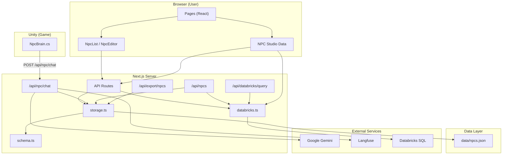
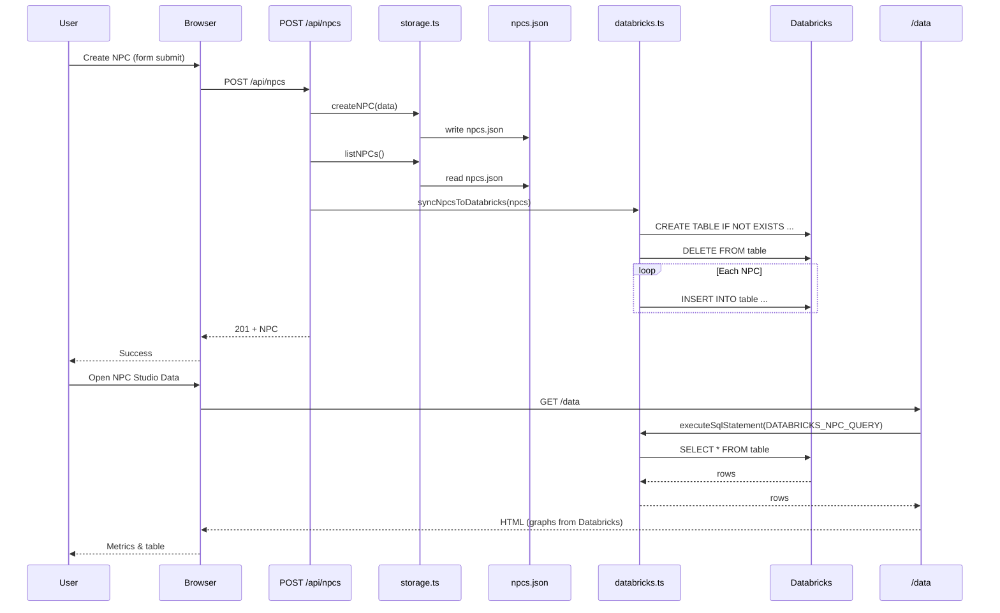
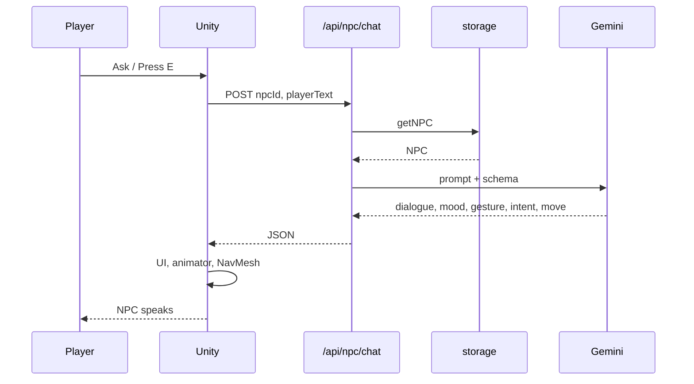

# NPC Studio — Tech Stack & Architecture

This document describes each layer of the program and how they connect. A diagram is at the end.

---

## Stack overview

| Layer | Technology | Purpose |
|-------|------------|---------|
| **Runtime** | Node.js | Server-side Next.js and API routes |
| **Framework** | Next.js 15 (App Router) | Pages, API routes, server components |
| **Language** | TypeScript 5 | End-to-end typing |
| **UI** | React 19, Tailwind CSS | No component library; Tailwind only |
| **Validation** | Zod | Request/response and NPC schema validation |
| **Storage** | File-based (`data/npcs.json`) | Single JSON file; no database |
| **AI / Chat** | Google Gemini (`@google/genai`) | NPC dialogue, mood, gestures, intent |
| **Observability** | Langfuse (optional) | Traces for chat route |
| **Data / Analytics** | Databricks (optional) | Sync roster to Delta table; query for Data page |
| **Unity** | C# scripts (NpcBrain, NpcInteractionTrigger) | Game client calling chat API |

**Secrets:** All from `process.env` (e.g. `.env.local`); nothing hardcoded.

---

## Layer 1: Presentation (browser)

**What it is:** What the user sees and interacts with in the browser.

| Piece | Location | Role |
|-------|----------|------|
| **Layout** | `src/app/layout.tsx` | Root HTML, nav (NPC Studio + link to NPC Studio Data), main wrapper |
| **Home** | `src/app/page.tsx` | Server component; loads NPCs via `listNPCs()`, renders `NpcList` |
| **NPC list** | `src/components/NpcList.tsx` | Hero, video, list of NPCs, create button, links to edit |
| **New NPC** | `src/app/npc/new/page.tsx` | Renders `NpcEditor` in create mode |
| **Edit NPC** | `src/app/npc/[id]/page.tsx` | Loads one NPC by id, renders `NpcEditor` |
| **NPC form** | `src/components/NpcForm.tsx` | Reusable form (name, role, persona, rules, capabilities, lore_facts); used by NpcEditor |
| **NPC editor** | `src/components/NpcEditor.tsx` | Wraps form, handles submit to API, chat test panel, Unity integration copy-paste |
| **Data page** | `src/app/data/page.tsx` | NPC Studio Data: summary cards, persona depth, NPCs by role, per-NPC table; optionally from Databricks |
| **Toast** | `src/components/Toast.tsx` | Small toast notifications (e.g. after save) |

**Data flow:** Pages are server components where it helps (e.g. home, data); they read from `@/lib/storage` or run Databricks queries. Client components (forms, editor) call API routes with `fetch` and update UI from responses.

---

## Layer 2: API routes (Next.js)

**What it is:** HTTP endpoints that the frontend and Unity call. All under `src/app/api/`.

| Route | Methods | Role |
|-------|---------|------|
| **`/api/npcs`** | GET, POST | List all NPCs; create one (body validated with Zod). After create, syncs to Databricks if configured. |
| **`/api/npcs/[id]`** | GET, PUT, DELETE | Get one, update one, delete one. After update/delete, syncs to Databricks if configured. |
| **`/api/npc/chat`** | POST, OPTIONS | **Brain endpoint:** body `{ npcId, playerText, world? }`. Loads NPC, builds prompt from persona/rules/capabilities/lore, calls Gemini with structured output (dialogue, mood, gesture, intent, move). Returns JSON; CORS enabled for Unity/WebGL. |
| **`/api/export/npcs`** | GET | Export roster: `?format=json` (default) or `?format=csv`. Uses `listNPCs()`; no auth. |
| **`/api/databricks/query`** | GET, POST | GET runs `DATABRICKS_NPC_QUERY`, POST runs body `{ statement }`. Returns `{ rows }` from Databricks SQL. |
| **`/api/unity/install`** | GET | Serves Unity quick-setup: when running locally, returns instructions and script paths; otherwise suggests GitHub download. |

**Flow:** Request → Zod validation (where applicable) → storage or external service → response. Chat route uses Gemini and optional Langfuse tracing.

---

## Layer 3: Business logic & data (server-only)

**What it is:** Code that runs only on the server: storage, schema, and Databricks client.

| Module | Location | Role |
|--------|----------|------|
| **Storage** | `src/lib/storage.ts` | Reads/writes `data/npcs.json`. Exposes `listNPCs`, `getNPC`, `createNPC`, `updateNPC`, `deleteNPC`. Uses `readFile`/`writeFile`; creates `data/` if needed. |
| **Schema** | `src/lib/schema.ts` | Zod schemas and types for NPC: `NPCSchema`, `NPCCreateSchema`, `NPCUpdateSchema`, gesture/action enums. Single source of truth for shape of an NPC. |
| **Databricks** | `src/lib/databricks.ts` | `getConfig()` from env; `executeSqlStatement(statement)` (returns rows); `runSqlStatement(statement)` (returns boolean); `syncNpcsToDatabricks(npcs)` (CREATE TABLE IF NOT EXISTS, DELETE, INSERT per NPC); `isDatabricksConfigured()`. Talks to Databricks SQL Statement Execution API (v2) over HTTPS. |

**Flow:** API routes call storage for CRUD; chat route calls storage for `getNPC` then builds prompt and calls Gemini. After any create/update/delete, routes call `syncNpcsToDatabricks(listNPCs())` when `DATABRICKS_SYNC_TABLE` is set.

---

## Layer 4: External services

**What it is:** Third-party systems the app talks to.

| Service | How it’s used |
|---------|----------------|
| **Google Gemini** | Chat route sends NPC context + player message; Gemini returns structured JSON (dialogue, mood, gesture, intent, move). API key from `GEMINI_API_KEY`. |
| **Langfuse** | Optional. Chat route creates a trace and generation; logs input/output and latency. Keys from `LANGFUSE_*`. |
| **Databricks** | Optional. Sync: after each NPC create/update/delete, full roster is written to `DATABRICKS_SYNC_TABLE` (Delta table). Query: Data page and `/api/databricks/query` run SQL via Statement Execution API; Data page uses result for graphs when shape matches. |

---

## Layer 5: Unity client (optional, separate runtime)

**What it is:** A Unity game that uses NPC Studio as the “brain” server.

| File | Role |
|------|------|
| **`unity/Scripts/NpcBrain.cs`** | Component on an NPC GameObject. Holds `serverUrl` and `npcId`. On `Ask(playerText)` (or from NpcInteractionTrigger), POSTs to `{serverUrl}/api/npc/chat` with `{ npcId, playerText, world? }`. Parses response (dialogue, mood, gesture, intent, move) and drives Animator, NavMeshAgent, and UI. |
| **`unity/Scripts/NpcInteractionTrigger.cs`** | Optional. Proximity check (player in range); on key press (e.g. E) calls `NpcBrain.Ask(defaultGreeting)`. |

**Flow:** Player talks in game → Unity sends message to NPC Studio `/api/npc/chat` → Gemini responds → Unity plays dialogue and animation.

---

## How the layers connect (diagram)

---

## Diagram 2: Sync and data flow (create NPC → Databricks → Data page)

---

## Diagram 3: Chat flow (Unity → NPC Studio → Gemini)

---

## Request flow examples

**1. User creates an NPC (browser)**  
Browser → `POST /api/npcs` (body validated with Zod) → `createNPC()` writes to `data/npcs.json` → `listNPCs()` → `syncNpcsToDatabricks(npcs)` (if configured) → `201` + NPC JSON.

**2. User opens NPC Studio Data**  
Browser → `GET /data` (server component) → `listNPCs()` for fallback; if configured, `executeSqlStatement(DATABRICKS_NPC_QUERY)` → if result has synced-table shape, metrics and graphs from Databricks rows; else from local NPCs → HTML with summary, role bars, table.

**3. Player talks to NPC in Unity**  
Unity `NpcBrain.Ask("Hello")` → `POST /api/npc/chat` with `{ npcId, playerText }` → `getNPC(npcId)` from storage → build prompt from NPC → Gemini (structured output) → response `{ dialogue, mood, gesture, intent, move }` → Unity shows line and drives animator.

**4. Sync to Databricks (on create/update/delete)**  
After any write in `/api/npcs` or `/api/npcs/[id]` → `syncNpcsToDatabricks(listNPCs())` → `runSqlStatement(CREATE TABLE IF NOT EXISTS ...)` → `runSqlStatement(DELETE FROM ...)` → for each NPC `runSqlStatement(INSERT INTO ...)` → Databricks table matches `npcs.json`.

---

## File map (quick reference)

| Path | Layer | Role |
|------|--------|------|
| `src/app/layout.tsx` | Presentation | Root layout, nav |
| `src/app/page.tsx` | Presentation | Home, passes npcs to NpcList |
| `src/app/npc/new/page.tsx`, `src/app/npc/[id]/page.tsx` | Presentation | New/edit NPC pages |
| `src/app/data/page.tsx` | Presentation | Data page, metrics from file or Databricks |
| `src/components/NpcList.tsx`, `NpcForm.tsx`, `NpcEditor.tsx`, `Toast.tsx` | Presentation | UI components |
| `src/app/api/npcs/route.ts`, `src/app/api/npcs/[id]/route.ts` | API | CRUD + sync |
| `src/app/api/npc/chat/route.ts` | API | Chat with Gemini |
| `src/app/api/export/npcs/route.ts` | API | Export JSON/CSV |
| `src/app/api/databricks/query/route.ts` | API | Run SQL, return rows |
| `src/app/api/unity/install/route.ts` | API | Unity setup help |
| `src/lib/storage.ts` | Data | File CRUD for npcs.json |
| `src/lib/schema.ts` | Data | Zod schemas, NPC type |
| `src/lib/databricks.ts` | Data | Databricks client, sync |
| `data/npcs.json` | Data | Single file store |
| `unity/Scripts/NpcBrain.cs`, `NpcInteractionTrigger.cs` | Unity | Game client |

---

## Databricks (optional) — summary

- **Config (env):** `DATABRICKS_HOST`, `DATABRICKS_ACCESS_TOKEN`, `DATABRICKS_WAREHOUSE_ID`, `DATABRICKS_SYNC_TABLE`, `DATABRICKS_NPC_QUERY`.
- **Write:** After every NPC create/update/delete, `syncNpcsToDatabricks(listNPCs())` updates the Delta table at `DATABRICKS_SYNC_TABLE`.
- **Read:** Data page runs `DATABRICKS_NPC_QUERY`; if the result matches the synced table shape, summary and graphs use Databricks; otherwise local file. `GET`/`POST /api/databricks/query` run SQL and return `{ rows }`.
- **No SDK:** All communication is HTTPS to the [Databricks SQL Statement Execution API](https://docs.databricks.com/api/workspace/statementexecution). See `docs/DATABRICKS.md` for setup.
